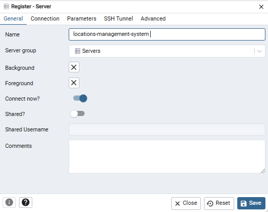
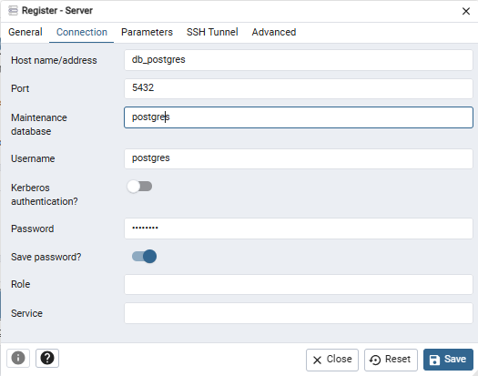

# Como Executar 🧰

Pela primeira vez, dentro de cada projeto, você deve compilar cada microsserviço utilizando o comando:

```bash
mvn clean package 
```

Com o Rancher ou Docker Desktop abertos, abra o terminal na pasta raiz e execute:

```bash
docker compose up --build
```

# Acessando os apps 🌐

## pgadmin

```bash
http://localhost:16543/login
```

```bash
email: admin@admin.com
senha: admin
```

Ao abrir pela primeira vez, clicar em Add New Server 

Host: db_postgres 
Port: 5432 
Maintenance Database: postgres
Username: postgres
Password: postgres




## eureka-server-app

```bash
http://localhost:8761/health
```

## auth-app

```bash
http://localhost:8181/swagger-ui/index.html
```

## locations-app

```bash
http://localhost:8182/swagger-ui/index.html
```

## requests-app

```bash
http://localhost:8183/swagger-ui/index.html
```

# users-app

```bash
http://localhost:8184/swagger-ui/index.html
```

